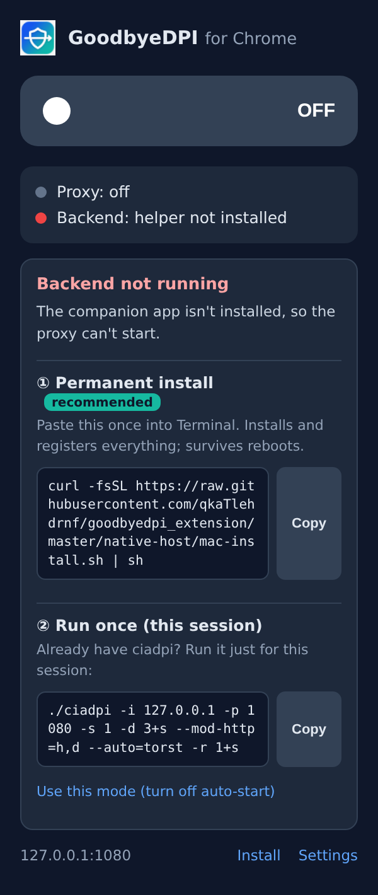
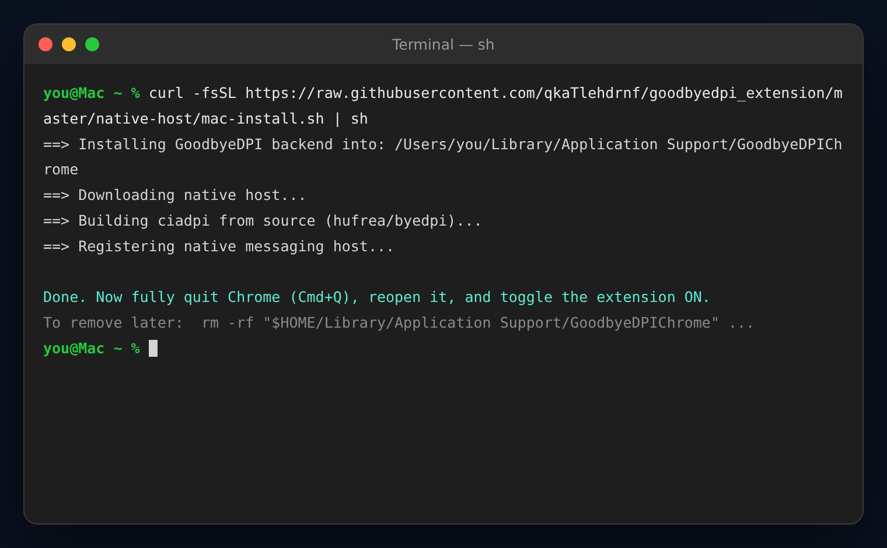
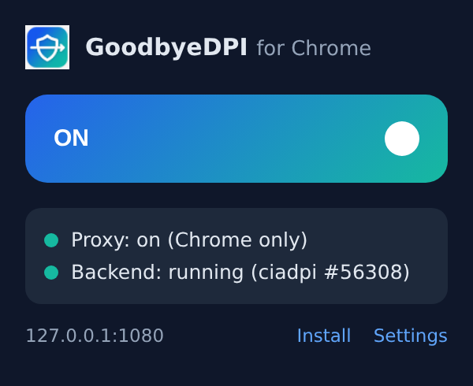
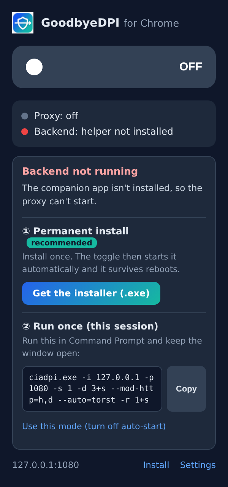

# 설치 단계별 안내 (스크린샷)

확장 설치 후 백엔드를 연결하는 과정을 단계별 화면과 함께 정리한 문서입니다.
팝업 스크린샷은 실제 `extension/popup.*` 코드를 그대로 렌더링해 캡처한 것이고,
터미널 화면은 `mac-install.sh` 의 실제 출력 메시지를 기반으로 한 예시입니다.

---

## macOS — 한 줄 영구 설치

### 1단계 — 토글을 켜면 설치 안내가 뜬다

웹스토어에서 확장을 설치한 직후에는 로컬 백엔드(`ciadpi`)가 없습니다.
토글을 켜려고 하면 확장이 이를 감지하고 **인터넷을 끊지 않은 채** 설치 안내 패널을 보여줍니다.
① 영구 설치 명령 옆의 **Copy** 를 누릅니다.

### 2단계 — 터미널에 붙여넣기 (한 번만)

복사한 한 줄을 터미널에 붙여넣으면 네이티브 호스트 다운로드 → `ciadpi` 내려받기 → Chrome 등록까지 자동으로 진행됩니다. 미리 빌드된 바이너리를 받으므로 컴파일러가 필요 없습니다.
(드물게 릴리스를 못 받는 환경이면 자동으로 소스 빌드로 넘어가는데, 그때만 `xcode-select --install` 을 한 번 실행한 뒤 다시 붙여넣으세요.)

### 3단계 — Chrome 완전 종료 후 재실행

Chrome 은 시작할 때만 네이티브 호스트 등록을 읽으므로, **Cmd+Q 로 완전히 종료**한 뒤 다시 엽니다.
(창만 닫으면 백그라운드에 남아 있어 인식되지 않습니다.)

### 4단계 — 토글 ON, 초록 확인

이제 토글을 켜면 확장이 `ciadpi` 를 자동 실행하고 Chrome 트래픽만 프록시로 보냅니다.
**Proxy / Backend 두 점이 모두 초록**이면 성공입니다. 재부팅해도 다시 설치할 필요가 없습니다.

---

## Windows

같은 안내 패널이지만 ① 이 명령어 대신 **설치 파일(.exe) 버튼**으로 나옵니다.
내려받아 실행하면 등록까지 끝나고, 이후 흐름(재시작 → 토글 ON)은 macOS 와 같습니다.

